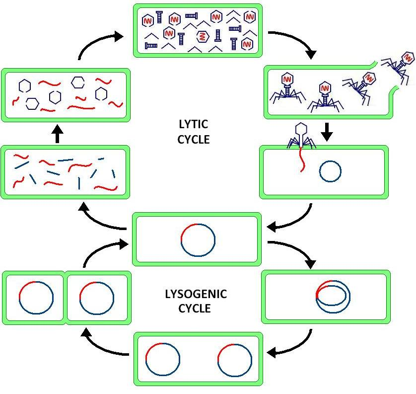

# Vivarium Phage Cycle Project

This project uses bigraph operations to simulate a toy model
 of the lytic and lysogenic cycles. This requires phage 
 attachement, gene insertion, gene integration, gene expression, 
 gene replication, cell division, phage assembly, and lysis.




## Installation

Explain how users can get up and running.

<!--
TODO: Fill in your own installation instructions. This might be as
simple as:

```
pip install <your package name>
```
-->
